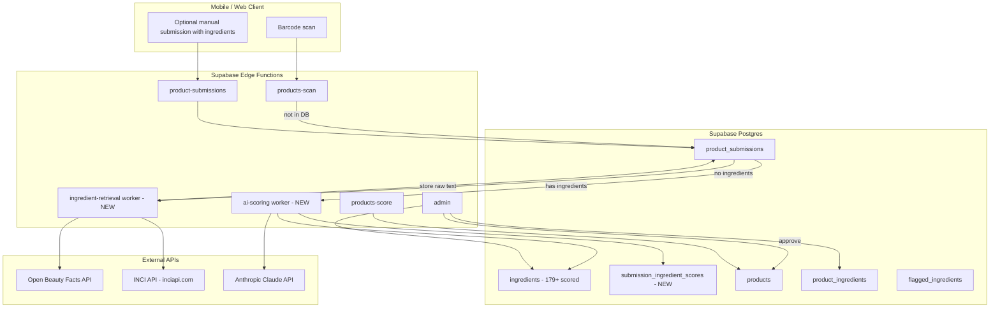

# Probaya — Automated Product Pipeline Specification

> **Purpose:** This document is the authoritative requirements and implementation guide for AI agents and engineers building Probaya’s **missed-scan → ingredient retrieval → AI scoring → admin review → publish** pipeline.  
> **Last updated:** 2026-05-19  
> **Status:** Requirements defined; pipeline modules partially implemented (see § What Already Exists).

---

## Table of Contents

1. [Executive Summary](#1-executive-summary)
2. [Problem Statement](#2-problem-statement)
3. [Architecture Overview](#3-architecture-overview)
4. [Two User Flows (Layer 1 + Layer 2)](#4-two-user-flows-layer-1--layer-2)
5. [Module 1 — Flagged Product Capture & Prioritization](#5-module-1--flagged-product-capture--prioritization)
6. [Module 2 — Ingredient List Retrieval](#6-module-2--ingredient-list-retrieval)
7. [Module 3 — AI Scoring Layer (Claude API)](#7-module-3--ai-scoring-layer-claude-api)
8. [Module 4 — Admin Review Queue](#8-module-4--admin-review-queue)
9. [Module 5 — Auto-Publish on Approval](#9-module-5--auto-publish-on-approval)
10. [What Already Exists (Do Not Rebuild)](#10-what-already-exists-do-not-rebuild)
11. [Schema & API Extensions Required](#11-schema--api-extensions-required)
12. [Environment Variables & Secrets](#12-environment-variables--secrets)
13. [Submission & Pipeline Status Model](#13-submission--pipeline-status-model)
14. [End-to-End Workflow (Maintainability)](#14-end-to-end-workflow-maintainability)
15. [Deliverables Checklist](#15-deliverables-checklist)
16. [Out of Scope](#16-out-of-scope)
17. [Open Items for Product Owner](#17-open-items-for-product-owner)

---

## 1. Executive Summary

When a user scans a product barcode and Probaya has **no live result**, the app today returns `source: "not_found"` with a submission prompt. The goal of this project is an **automated backend pipeline** that:

1. **Never loses a scan** — logs every missed barcode into `product_submissions` (pending queue).
2. **Retrieves ingredients automatically** when the user did not supply them (Open Beauty Facts → INCI API).
3. **Scores ingredients** via Claude using Probaya’s methodology, reusing the **179+ existing scored ingredients** in the database when possible.
4. **Queues everything for admin approval** — nothing goes live without human sign-off.
5. **Publishes on approval** — new ingredients, `product_ingredients` links, normalized 0–100 score, live `products` row.

---

## 2. Problem Statement

| Today | Target |
|-------|--------|
| Missed scan → empty result + optional manual submission | Missed scan → auto `product_submissions` row + background processing |
| Most users scan and leave without typing ingredients | Automated retrieval for submissions with no `ingredients` |
| No AI-assisted scoring for new products | Claude suggests per-ingredient scores with confidence + review flags |
| Admin approve only copies raw text to `products` | Approve promotes product **and** ingredients **and** computed score |

---

## 3. Architecture Overview



**Processing order (priority):** `scan_count` DESC → `submitted_at` ASC (oldest first within same popularity).

---

## 4. Two User Flows (Layer 1 + Layer 2)

### Layer 1 — Engaged user (manual submission) — **KEEP**

User scans → no result → user opens submission form → provides `product_name`, `barcode`, optionally `ingredients`, etc.

- **Endpoint:** `POST /functions/v1/product-submissions` (auth required today).
- **Storage:** `product_submissions` with `status = 'pending'`.
- **If `ingredients` is non-empty:** Skip Module 2 (retrieval). Proceed to Module 3 (AI scoring).
- **If `ingredients` is empty:** Run Module 2 retrieval chain, then Module 3.

### Layer 2 — Passive user (scan only) — **BUILD**

User scans → no result → user leaves.

- **Trigger:** Failed scan (`products-scan` returns `source: "not_found"`), **not** the outcome of ingredient retrieval.
- **Action:** Upsert/create `product_submissions` row for that barcode immediately (even if retrieval later fails).
- **Auth:** Prefer logged-in `user_id` when JWT present; support anonymous scans (see §11 — `user_id` nullable or system placeholder).
- **Increment `scan_count`** when the same barcode is scanned again by any user.

### Decision table (routing after submission exists)

| `ingredients` column | `pipeline_status` (proposed) | Next step |
|---------------------|------------------------------|-----------|
| Non-null, non-empty | `ready_for_scoring` | Module 3 — Claude scoring |
| Null or empty | `awaiting_retrieval` | Module 2 — OBF → INCI API |
| Retrieval failed (both sources) | `ingredients_not_found` | Admin manual review only |
| Scoring complete | `awaiting_admin_review` | Module 4 — Admin queue |
| Admin approved | `approved` | Module 5 — Publish (may overlap with approve handler) |
| Admin rejected | `rejected` | Terminal |

---

## 5. Module 1 — Flagged Product Capture & Prioritization

### 5.1 Requirements

When `products-scan` finds **no row in `products`** for the barcode (after DB lookup; OBF hit during scan does **not** auto-create a submission — user may still submit OBF-found products separately):

1. **Upsert** `product_submissions` by `barcode` (one pending row per barcode recommended).
2. **Capture:**
   - `barcode` (required)
   - `submitted_at` / `last_scanned_at` (timestamps)
   - `user_id` (nullable if anonymous — see schema note)
   - `scan_count` (integer, default 1; increment on duplicate scans)
3. **Prioritize** background workers: `ORDER BY scan_count DESC, submitted_at ASC`.
4. Do **not** block the scan HTTP response on retrieval or scoring (async worker / cron / queue).

### 5.2 Integration point (existing code)

Current orchestrator (`supabase/functions/_shared/services/barcode-scan/orchestrator.ts`):

1. DB lookup via `findProductByBarcode`
2. Open Beauty Facts via `fetchObfByBarcode`
3. Return `not_found` + `submissionPrompt`

**Required change:** After step 1 fails (and optionally regardless of step 2 OBF result for “not in our catalog”), call new `upsertPendingSubmissionFromScan(barcode, userId?)` before returning.

> **Clarification:** Auto-log on `not_found` means barcode absent from **`products`** table. OBF may still return preview data to the client; submission row captures demand for **Probaya catalog** inclusion.

### 5.3 Default product metadata on auto-capture

When auto-created from scan only (no manual form):

- `product_name`: `"Pending — {barcode}"` or name from OBF/INCI if discovered during retrieval
- `brand`, `category`, `image_url`: fill when retrieval provides them
- `ingredients`: null until Module 2 or user provides

---

## 6. Module 2 — Ingredient List Retrieval

### 6.1 Goal

For each `product_submissions` row with **no user-provided ingredients**, automatically fetch raw ingredient text by barcode.

### 6.2 Fallback chain (final — no web scraping)

| Order | Source | Notes |
|-------|--------|-------|
| 1 | **Open Beauty Facts** | Already implemented: `supabase/functions/_shared/services/open-beauty-facts/client.ts` — `GET https://world.openbeautyfacts.org/api/v2/product/{barcode}.json` |
| 2 | **INCI API** (`inciapi.com`) | `GET https://api.inciapi.com/v1/products/{barcode}` with `X-API-Key` header |
| — | **If both fail** | Set `pipeline_status = 'ingredients_not_found'`; keep row for admin |

**Removed from scope:** INCI Decoder scraping, generic web scraping (Ulta, Target, brand sites).

### 6.3 INCI API — authentication (action for product owner)

| Item | Detail |
|------|--------|
| **API key required?** | **Yes** — all requests need header `X-API-Key: sk_live_...` |
| **Registration** | https://inciapi.com/register → Dashboard → API keys |
| **Docs** | https://inciapi.com/docs |
| **Free tier** | 100 requests/month (verify current plan on dashboard) |
| **Env var (proposed)** | `INCI_API_KEY` in Edge Function secrets |
| **Primary field to store** | `product.ingredients` (comma-separated string) or `product.details.inci` (array) — normalize to single `ingredients` text on `product_submissions` |

Example request:

```http
GET https://api.inciapi.com/v1/products/0085275710434
X-API-Key: sk_live_your_api_key
```

### 6.4 Retrieval logic (pseudocode)

```
for submission in pending where pipeline_status = 'awaiting_retrieval':
  if submission.ingredients is not null and trim != '':
    set pipeline_status = 'ready_for_scoring'
    continue

  raw = fetchObfIngredientsText(barcode)  // ingredients_text or joined structured list
  source = 'open_beauty_facts'

  if not raw:
    inci = fetchInciApiProduct(barcode)   // new client in _shared/services/inci-api/
    raw = inci.ingredients or join(inci.details.inci)
    source = 'inci_api'

  if raw:
    update submission set ingredients = raw, retrieval_source = source, pipeline_status = 'ready_for_scoring'
  else:
    update submission set pipeline_status = 'ingredients_not_found', retrieval_source = null
```

### 6.5 Store on success

- `product_submissions.ingredients` — raw ingredient text (comma-separated or as returned).
- `product_submissions.retrieval_source` — `'user' | 'open_beauty_facts' | 'inci_api'` (proposed column).
- Optionally cache OBF/INCI product name, brand, image on the submission row for admin UI.

### 6.6 Skip condition

If user already provided `ingredients` on create/update → **skip Module 2**, set `retrieval_source = 'user'`, `pipeline_status = 'ready_for_scoring'`.

---

## 7. Module 3 — AI Scoring Layer (Claude API)

### 7.1 Goal

Score each parsed ingredient using Probaya’s methodology. Prefer database scores over AI.

### 7.2 Pre-processing

1. Parse `product_submissions.ingredients` into individual ingredient strings (comma/semicolon split; trim; dedupe case-insensitively where safe).
2. For each ingredient, lookup `ingredients` table by `inci_name` (case-insensitive match; normalize whitespace).

### 7.3 Database-first rule

| Condition | Action |
|-----------|--------|
| Ingredient exists in `ingredients` with valid `impact_score` and classification ≠ `No Data` | Copy `impact_score`, `classification`, `plain_english_summary`; `source = 'database'`; **no Claude call** |
| Ingredient missing or `No Data` / null score | Send to Claude for suggestion |

### 7.4 Claude API contract

**Input to Claude:**

- System prompt: Probaya scoring methodology (**provided separately by product owner** — store in repo as `prompts/ingredient-scoring-system.md` or env `CLAUDE_SCORING_SYSTEM_PROMPT`).
- User message: JSON array of ingredient names needing scoring + optional product context (`product_name`, `brand`, `category`).

**Impact score scale (must match DB):**

| Label | Meaning |
|-------|---------|
| `+2` | Strongly Beneficial |
| `+1` | Mildly Beneficial |
| `0` | Neutral |
| `-1` | Mildly Harmful |
| `-2` | Strongly Harmful |
| `No Data` | Insufficient evidence |

**Stored DB format for scores:** text labels `"(+2)"`, `"(+1)"`, `"(0)"`, `"(-1)"`, `"(-2)"` — see `supabase/functions/_shared/services/scoring/impact-score.ts`.

**Required JSON output per ingredient** (array):

```json
{
  "ingredient_name": "Niacinamide",
  "inci_name": "niacinamide",
  "suggested_impact_score": "+2",
  "confidence": "high",
  "brief_reasoning": "Well-studied barrier support with strong tolerability profile.",
  "needs_human_review": false,
  "source": "claude"
}
```

| Field | Type | Rules |
|-------|------|-------|
| `ingredient_name` | string | Display name |
| `inci_name` | string | Normalized INCI for matching |
| `suggested_impact_score` | string | One of: `+2`, `+1`, `0`, `-1`, `-2`, `No Data` |
| `confidence` | string | `high` \| `medium` \| `low` |
| `brief_reasoning` | string | 1–2 sentences |
| `needs_human_review` | boolean | `true` if confidence is `low`, ingredient ambiguous, or conflicting evidence |
| `source` | string | `database` \| `claude` |

**Env vars (proposed):** `ANTHROPIC_API_KEY`, optional `CLAUDE_MODEL` (e.g. `claude-sonnet-4-20250514`).

### 7.5 Persistence (proposed table `submission_ingredient_scores`)

Store one row per ingredient per submission until admin resolves. Suggested columns:

- `id`, `submission_id`, `ingredient_name`, `inci_name`
- `suggested_impact_score`, `suggested_classification` (map from score)
- `confidence`, `brief_reasoning`, `needs_human_review`
- `source` (`database` \| `claude`)
- `admin_status` (`pending` \| `approved` \| `rejected` \| `edited`)
- `final_impact_score`, `final_classification` (after admin edit)

After successful scoring run: `product_submissions.pipeline_status = 'awaiting_admin_review'`.

### 7.6 Flagged ingredients integration

Ingredients with `No Data` or missing from catalog should also appear in existing `flagged_ingredients` flow per README “Ingredient Gap Checker” — align with `POST admin?resource=flagged-ingredients&action=sync-no-data` where appropriate.

---

## 8. Module 4 — Admin Review Queue

### 8.1 Goal

Admin reviews pending products **before** anything is public. Review at **product** and **ingredient** level.

### 8.2 Existing admin surface (extend, do not replace)

**Auth:** `x-admin-secret: <ADMIN_SECRET>` on `/functions/v1/admin`

| Resource | Today | Needed enhancement |
|----------|-------|-------------------|
| `GET ?resource=submissions` | Lists pending rows | Include `scan_count`, `pipeline_status`, `retrieval_source`, parsed ingredient scores from `submission_ingredient_scores` |
| `POST ?resource=submissions&action=approve&id=` | Inserts `products` row only | Full Module 5 publish pipeline |
| `POST ?resource=submissions&action=reject&id=` | Sets rejected | OK |
| Ingredient CRUD | `POST/PATCH ?resource=ingredients` | Use for per-ingredient approve/edit |

### 8.3 Admin review payload (target response shape)

```json
{
  "submission": {
    "id": "uuid",
    "barcode": "1234567890123",
    "product_name": "Example Serum",
    "brand": "Example Co",
    "ingredients_raw": "Water, Niacinamide, ...",
    "scan_count": 42,
    "pipeline_status": "awaiting_admin_review",
    "retrieval_source": "inci_api",
    "submitted_at": "2026-05-19T12:00:00Z"
  },
  "ingredients": [
    {
      "id": "uuid",
      "ingredient_name": "Niacinamide",
      "inci_name": "niacinamide",
      "suggested_impact_score": "(+2)",
      "confidence": "high",
      "brief_reasoning": "...",
      "needs_human_review": false,
      "source": "database",
      "admin_status": "pending"
    }
  ],
  "uncertain_ingredients": ["Fragrance (parfum)"],
  "product_score_preview": 72
}
```

### 8.4 Admin actions (per ingredient)

- **Approve** — accept suggested (or edited) score
- **Reject** — exclude from product or mark No Data
- **Edit** — override `impact_score` / `classification` / summary

### 8.5 Admin actions (per product)

- **Approve all** — run Module 5 (single action preferred for UX)
- **Reject** — `status = rejected`, optional `review_notes`

**Rule:** Nothing writes to public `products` / `product_ingredients` until admin approves.

---

## 9. Module 5 — Auto-Publish on Approval

### 9.1 On `approveSubmission` (enhance existing)

Current behavior (`supabase/functions/_shared/services/admin/repository.ts` → `approveSubmission`):

- Inserts `products` with `ingredients_list` from submission text
- Does **not** link `product_ingredients`, compute score, or insert new `ingredients`

**Required behavior on approve:**

1. For each **admin-approved** ingredient:
   - If new: `INSERT` into `ingredients` with confirmed scores and required metadata (admin may need to fill study fields or use placeholders per business rules).
   - If existing: use existing `ingredient_id`.
2. `INSERT` into `product_ingredients` linking product ↔ ingredient.
3. Call existing scoring engine: `computeProductScore()` in `supabase/functions/_shared/services/scoring/engine.ts`.
4. Persist `products.score` via `products-score` logic or inline update.
5. Set `product_submissions.status = 'approved'`, `pipeline_status = 'published'`.
6. Set `products.verified = true` (if business rule confirmed).

### 9.2 Normalized product score (existing algorithm — do not reimplement)

From `engine.ts`:

```
raw_score = sum(numeric impact scores for scored ingredients)
minimum_possible = n × -2
maximum_possible = n × 2
normalized = ((raw_score - minimum_possible) / (maximum_possible - minimum_possible)) × 100
final_score = round(clamp(normalized, 0, 100))
```

- Exclude `classification = 'No Data'` from calculation.
- Ratings: 70–100 Microbiome Friendly, 40–69 Use With Caution, 0–39 Not Recommended.

---

## 10. What Already Exists (Do Not Rebuild)

### 10.1 Edge Functions & docs

| Asset | Location |
|-------|----------|
| Barcode scan (DB → OBF → not_found) | `supabase/functions/products-scan/`, `docs/api/01-barcode-scan.md` |
| Product score (0–100) | `supabase/functions/products-score/`, `docs/api/02-product-score.md` |
| Auth, saved products | `docs/api/03-authentication.md`, `04-saved-products.md` |
| Manual product submission | `supabase/functions/product-submissions/`, `docs/api/05-product-submissions.md` |
| Admin (flagged ingredients, submissions, ingredients CRUD) | `supabase/functions/admin/`, `docs/api/06-admin.md` |
| Full API reference | `docs/api/backend-api-reference.md` |
| OBF client | `supabase/functions/_shared/services/open-beauty-facts/client.ts` |
| Scoring engine | `supabase/functions/_shared/services/scoring/engine.ts` |
| Ingredient / product repositories | `_shared/services/ingredients/`, `_shared/services/products/` |

### 10.2 Database (migration `20260413183000_init_schema.sql`)

- `products`, `ingredients`, `product_ingredients`, `scoring_rules`, `saved_products`
- `product_submissions` (pending queue baseline)
- `flagged_ingredients`
- **~179 scored ingredients** in seed/production data (match via `inci_name`)

### 10.3 Not yet built (this spec)

- Auto upsert on failed scan + `scan_count`
- INCI API client
- Background workers (retrieval + scoring)
- `submission_ingredient_scores` (or equivalent)
- Claude integration
- Enhanced approve → full publish pipeline
- `pipeline_status` / retrieval metadata columns

---

## 11. Schema & API Extensions Required

### 11.1 `product_submissions` — proposed new columns

| Column | Type | Purpose |
|--------|------|---------|
| `scan_count` | integer NOT NULL DEFAULT 1 | Prioritization |
| `last_scanned_at` | timestamptz | Last demand signal |
| `pipeline_status` | text | See §13 |
| `retrieval_source` | text | `user`, `open_beauty_facts`, `inci_api`, null |
| `last_retrieval_at` | timestamptz | Debugging |
| `last_scoring_at` | timestamptz | Debugging |
| `scoring_error` | text | Last Claude/worker error |

**Migration consideration:** `user_id` is currently `NOT NULL`. For passive scans without auth, either:

- Make `user_id` **nullable**, or
- Use a dedicated **system user** UUID for anonymous scans.

**Uniqueness:** Consider `UNIQUE (barcode) WHERE status = 'pending'` to avoid duplicate pending rows.

### 11.2 New table: `submission_ingredient_scores`

See §7.5. Foreign key `submission_id → product_submissions(id) ON DELETE CASCADE`.

### 11.3 New Edge Functions (suggested)

| Function | Trigger | Role |
|----------|---------|------|
| `pipeline-retrieval` | Cron / internal POST | Module 2 batch |
| `pipeline-scoring` | Cron / internal POST | Module 3 batch |
| Or single `pipeline-worker` | Cron | Both modules in priority order |

Protect workers with `ADMIN_SECRET` or Supabase service role + `pg_cron` / external scheduler.

### 11.4 `products-scan` change

After `not_found`, invoke submission upsert (Module 1) — keep response fast (<200ms target excluding upsert if async).

---

## 12. Environment Variables & Secrets

| Variable | Required | Module | Notes |
|----------|----------|--------|-------|
| `SUPABASE_URL` | Yes | All | Existing |
| `SUPABASE_SERVICE_ROLE_KEY` | Yes | All | Existing |
| `SUPABASE_ANON_KEY` | Yes | Auth | Existing |
| `ADMIN_SECRET` | Yes | Admin / workers | Existing |
| `INCI_API_KEY` | Yes | Module 2 | **Product owner must register at inciapi.com** |
| `ANTHROPIC_API_KEY` | Yes | Module 3 | Claude |
| `CLAUDE_MODEL` | No | Module 3 | Default in code if unset |
| `CLAUDE_SCORING_SYSTEM_PROMPT` | Yes* | Module 3 | *Or file path in repo once PO provides methodology |

---

## 13. Submission & Pipeline Status Model

### 13.1 `product_submissions.status` (existing)

- `pending` | `approved` | `rejected`

### 13.2 `product_submissions.pipeline_status` (proposed)

| Value | Meaning |
|-------|---------|
| `awaiting_retrieval` | No ingredients yet; Module 2 should run |
| `retrieval_in_progress` | Worker claimed row (optional, prevents double work) |
| `ingredients_not_found` | OBF + INCI API both failed |
| `ready_for_scoring` | Ingredients text available |
| `scoring_in_progress` | Module 3 running |
| `scoring_failed` | Claude error; retry eligible |
| `awaiting_admin_review` | Scores stored; admin action needed |
| `published` | Live in `products` |
| `rejected` | Admin rejected (terminal) |

---

## 14. End-to-End Workflow (Maintainability)

### 14.1 Sequence — passive scan (happy path)

1. User scans barcode `X` → not in `products`.
2. `products-scan` returns `not_found`; **async** upsert `product_submissions` (`scan_count++` if exists).
3. Worker: OBF returns `ingredients_text` → save → `ready_for_scoring`.
4. Worker: match DB ingredients; Claude scores remainder → `submission_ingredient_scores` → `awaiting_admin_review`.
5. Admin: `GET admin?resource=submissions` (enriched) → reviews → **Approve**.
6. Approve handler: create ingredients + links + `computeProductScore` → `products.score` set.
7. Next scan of `X` → `source: "database"` with full breakdown.

### 14.2 Sequence — engaged user with ingredients

1. User `POST product-submissions` with `ingredients` filled.
2. Skip retrieval → `ready_for_scoring` → Claude path as above.

### 14.3 Failure path — no ingredients found

1. Steps 1–2 same as passive scan.
2. Worker: OBF miss, INCI API miss → `ingredients_not_found`.
3. Admin manually adds ingredients or rejects submission.

### 14.4 Operational notes

- **Idempotency:** Workers should skip rows already in `retrieval_in_progress` / `scoring_in_progress` or use row-level locking.
- **Rate limits:** INCI API 100 req/mo on free tier — batch size + monitoring required.
- **Logging:** Log `barcode`, `submission_id`, `retrieval_source`, Claude token usage (no PII in logs).
- **Retries:** Exponential backoff for transient API failures; max 3 attempts before `scoring_failed`.

---

## 15. Deliverables Checklist

| # | Deliverable | Module | Status |
|---|-------------|--------|--------|
| 1 | Auto capture + `scan_count` prioritization in Supabase | 1 | Not started |
| 2 | Ingredient retrieval (OBF + INCI API) | 2 | OBF partial (scan only); worker not started |
| 3 | Claude API + DB-first ingredient scoring | 3 | Not started |
| 4 | Admin review queue API (enriched submissions + per-ingredient scores) | 4 | Partial (basic list/approve) |
| 5 | Auto-publish on approval (ingredients + links + score) | 5 | Partial (product row only) |
| 6 | This specification + workflow documentation | All | **This document** |

---

## 16. Out of Scope

- Web scraping (INCI Decoder HTML, retailer sites, brand sites)
- Replacing existing 15 API endpoints / rescoring the 179-ingredient seed dataset
- Mobile UI for admin (API + Supabase table view is sufficient initially)
- Real-time push notifications to admin

---

## 17. Open Items for Product Owner

| Item | Owner action |
|------|----------------|
| Claude system prompt | Provide Probaya scoring methodology text for `prompts/ingredient-scoring-system.md` |
| INCI API key | Register at https://inciapi.com/register → add `INCI_API_KEY` to Supabase secrets |
| Anonymous scans | Confirm: nullable `user_id` vs system user |
| New ingredient metadata on publish | When Claude suggests a score, are `study_title`, `pubmed_link`, etc. required before approve or can placeholders be used? |
| OBF during scan | Confirm whether OBF-found-but-not-in-DB products should also auto-create `product_submissions` or only pure `not_found` |

---

## Appendix A — Code References (implementation anchors)

| Concern | File |
|---------|------|
| Scan orchestration | `supabase/functions/_shared/services/barcode-scan/orchestrator.ts` |
| OBF fetch | `supabase/functions/_shared/services/open-beauty-facts/client.ts` |
| Create submission | `supabase/functions/_shared/services/submissions/repository.ts` |
| Approve submission (extend) | `supabase/functions/_shared/services/admin/repository.ts` → `approveSubmission` |
| Score computation | `supabase/functions/_shared/services/scoring/engine.ts` |
| DB schema | `supabase/migrations/20260413183000_init_schema.sql` |

---

## Appendix B — INCI API quick reference

```bash
curl -sS "https://api.inciapi.com/v1/products/{BARCODE}" \
  -H "X-API-Key: $INCI_API_KEY"
```

Primary fields for Probaya retrieval:

- `product.ingredients` — string
- `product.details.inci` — string array (preferred for parsing)
- `product.name`, `product.brand`, `product.imageUrls` — enrich submission metadata

---

*End of specification. When implementing, update the [Deliverables Checklist](#15-deliverables-checklist) and mark modules complete in PR descriptions.*
