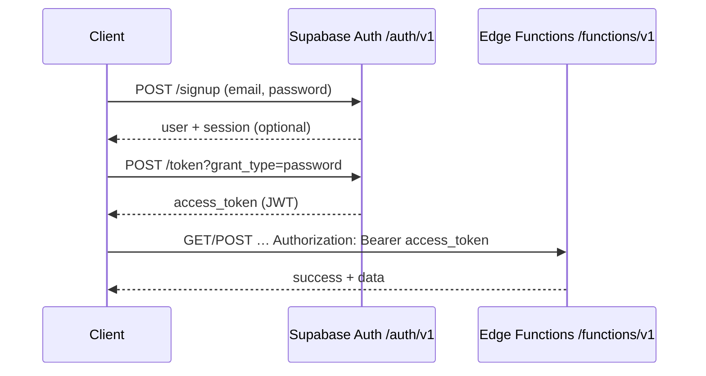

# Probaya backend API reference

This document describes every HTTP surface used by the Probaya backend: **Supabase Auth** (create account, obtain JWT) and **Edge Functions** under `/functions/v1/`.

All successful JSON responses from Edge Functions use this envelope:

```json
{ "success": true, "data": … }
```

Errors:

```json
{ "success": false, "error": "message" }
```

**Base URLs**

| Environment | Base |
|-------------|------|
| Local (default from `supabase/config.toml`) | `http://127.0.0.1:54321` |
| Hosted | `https://<PROJECT_REF>.supabase.co` |

Replace placeholders in `curl` examples:

- `$SUPABASE_URL` — project API URL (local or hosted).
- `$ANON_KEY` — public **anon** key (Dashboard → Project Settings → API, or local `supabase status`).
- `$ACCESS_TOKEN` — user JWT from Auth (see below).
- `$ADMIN_SECRET` — value of the `ADMIN_SECRET` Edge Function secret (Dashboard or CLI).

---

## 1. Authentication and user registration (Supabase Auth)

User-facing routes (`saved-products`, `product-submissions`) require:

```http
Authorization: Bearer <ACCESS_TOKEN>
```

The access token is **not** issued by a custom Edge Function. It comes from **Supabase Auth** via the REST API or the Supabase client.

### 1.1 Flow: sign up → sign in → call Edge Functions



### 1.2 Create user (sign up)

**`POST`** `{SUPABASE_URL}/auth/v1/signup`

Registers a new user. Email confirmation behavior depends on project settings (`enable_confirmations` in `supabase/config.toml`).

```bash
curl -sS -X POST "$SUPABASE_URL/auth/v1/signup" \
  -H "apikey: $ANON_KEY" \
  -H "Content-Type: application/json" \
  -d '{
    "email": "user@example.com",
    "password": "your-secure-password"
  }'
```

**Example response (201)**

```json
{
  "access_token": "eyJhbGciOiJIUzI1NiIsInR5cCI6IkpXVCJ9...",
  "token_type": "bearer",
  "expires_in": 3600,
  "expires_at": 1770000000,
  "refresh_token": "mxvbpwyoff...",
  "user": {
    "id": "a1b2c3d4-e5f6-7890-abcd-ef1234567890",
    "aud": "authenticated",
    "role": "authenticated",
    "email": "user@example.com",
    "email_confirmed_at": "2026-04-19T12:00:00.000Z",
    "phone": "",
    "confirmed_at": "2026-04-19T12:00:00.000Z",
    "last_sign_in_at": "2026-04-19T12:00:00.000Z",
    "app_metadata": {},
    "user_metadata": {},
    "identities": [],
    "created_at": "2026-04-19T12:00:00.000Z",
    "updated_at": "2026-04-19T12:00:00.000Z"
  }
}
```

If signups return a user without `access_token` (e.g. confirmation required), complete email confirmation then use **sign in** below.

### 1.3 Get a user JWT (sign in with password)

**`POST`** `{SUPABASE_URL}/auth/v1/token?grant_type=password`

Returns `access_token` for subsequent `Authorization: Bearer` calls.

```bash
curl -sS -X POST "$SUPABASE_URL/auth/v1/token?grant_type=password" \
  -H "apikey: $ANON_KEY" \
  -H "Content-Type: application/json" \
  -d '{
    "email": "user@example.com",
    "password": "your-secure-password"
  }'
```

**Example response (200)**

```json
{
  "access_token": "eyJhbGciOiJIUzI1NiIsInR5cCI6IkpXVCJ9...",
  "token_type": "bearer",
  "expires_in": 3600,
  "expires_at": 1770000000,
  "refresh_token": "v2wq...",
  "user": {
    "id": "a1b2c3d4-e5f6-7890-abcd-ef1234567890",
    "aud": "authenticated",
    "role": "authenticated",
    "email": "user@example.com"
  }
}
```

Use `access_token` as `$ACCESS_TOKEN` in the examples below.

### 1.4 Refresh session (optional)

**`POST`** `{SUPABASE_URL}/auth/v1/token?grant_type=refresh_token` with body `{ "refresh_token": "..." }` — see [Supabase Auth](https://supabase.com/docs/reference/javascript/auth-refreshsession).

---

## 2. Edge Functions overview

| Method | Function | Purpose |
|--------|----------|---------|
| `GET` | `products-scan` | Resolve barcode → catalog / Open Beauty Facts / not found |
| `GET` | `products-score` | Compute and persist product score |
| `POST` | `product-submissions` | Authenticated product submission for review |
| `GET` / `POST` / `DELETE` | `saved-products` | List, add, remove saved products (JWT) |
| `GET` / `PUT` / `POST` / `PATCH` | `admin` | Moderation: flagged ingredients, submissions, ingredients (`x-admin-secret`) |

Full URL pattern:

`$SUPABASE_URL/functions/v1/<function-name>[?query]`

---

## 3. `GET` products-scan (barcode scan)

Looks up a barcode in the database, then Open Beauty Facts, and returns ingredient details and an optional submission prompt.

**Query parameters**

| Name | Required | Description |
|------|----------|---------------|
| `barcode` | Yes | Barcode string |

```bash
curl -sS "$SUPABASE_URL/functions/v1/products-scan?barcode=73010713192"
```

**Example response — found in database (`source`: `database`)**

```json
{
  "success": true,
  "data": {
    "source": "database",
    "product": {
      "id": "11111111-2222-3333-4444-555555555555",
      "barcode": "73010713192",
      "product_name": "Example Tampons",
      "brand": "Example Brand",
      "category": "Feminine Hygiene",
      "image_url": "https://example.com/image.jpg",
      "ingredients_list": "Cotton, Rayon",
      "score": null,
      "verified": false
    },
    "ingredients": [
      {
        "ingredient_name": "Rayon",
        "inci_name": "Rayon",
        "classification": "Neutral",
        "plain_english_summary": "A manufactured cellulose fiber.",
        "impact_score": "(0)"
      }
    ],
    "submissionPrompt": null
  }
}
```

**Example response — from Open Beauty Facts only (`source`: `open_beauty_facts`)**

```json
{
  "success": true,
  "data": {
    "source": "open_beauty_facts",
    "product": {
      "id": "00000000-0000-0000-0000-000000000000",
      "barcode": "3600530771944",
      "product_name": "OBF Product",
      "brand": null,
      "category": null,
      "image_url": null,
      "ingredients_list": null,
      "score": null,
      "verified": null
    },
    "ingredients": [],
    "submissionPrompt": {
      "message": "Product found via Open Beauty Facts but not in our catalog. You may submit it for review.",
      "submitFunction": "product-submissions"
    }
  }
}
```

**Example response — not found (`source`: `not_found`)**

```json
{
  "success": true,
  "data": {
    "source": "not_found",
    "product": null,
    "ingredients": [],
    "submissionPrompt": {
      "message": "Product not found. Submit details so our team can review and add it.",
      "submitFunction": "product-submissions"
    }
  }
}
```

**Typical error (400)**

```json
{
  "success": false,
  "error": "Query parameter `barcode` is required"
}
```

---

## 4. `GET` products-score

Computes score from linked ingredients, updates `products.score` when a numeric score exists, and returns breakdown.

**Query parameters**

| Name | Required | Description |
|------|----------|-------------|
| `productId` | Yes | Product UUID |

```bash
curl -sS "$SUPABASE_URL/functions/v1/products-score?productId=11111111-2222-3333-4444-555555555555"
```

**Example response (200)**

```json
{
  "success": true,
  "data": {
    "product": {
      "product_name": "Example Tampons",
      "brand": "Example Brand",
      "category": "Feminine Hygiene",
      "image_url": "https://example.com/image.jpg",
      "score": 72,
      "ingredients": "Cotton, Rayon",
      "rating": "Microbiome Friendly"
    },
    "ingredients": [
      {
        "ingredient_name": "Cotton",
        "inci_name": "Gossypium Herbaceum",
        "classification": "Beneficial",
        "plain_english_summary": "Natural fiber.",
        "impact_score": "(+1)"
      }
    ],
    "summary": {
      "beneficial_count": 1,
      "harmful_count": 0,
      "neutral_count": 1,
      "no_data_count": 0
    }
  }
}
```

**Not found (404)**

```json
{
  "success": false,
  "error": "Product not found"
}
```

---

## 5. `POST` product-submissions

Creates a pending submission tied to the authenticated user.

**Authentication:** `Authorization: Bearer $ACCESS_TOKEN` (see [§1](#1-authentication-and-user-registration-supabase-auth)).

**Body (JSON)**

| Field | Required | Type |
|-------|----------|------|
| `product_name` | Yes | string |
| `barcode` | Yes | string |
| `brand` | No | string or null |
| `category` | No | string or null |
| `image_url` | No | string or null |
| `ingredients` | No | string or null |

```bash
curl -sS -X POST "$SUPABASE_URL/functions/v1/product-submissions" \
  -H "Authorization: Bearer $ACCESS_TOKEN" \
  -H "Content-Type: application/json" \
  -d '{
    "product_name": "New Organic Liner",
    "brand": "EcoCo",
    "barcode": "1234567890123",
    "category": "Feminine Hygiene",
    "ingredients": "Organic cotton, plant starch"
  }'
```

**Example response (201)**

```json
{
  "success": true,
  "data": {
    "id": "aaaaaaaa-bbbb-cccc-dddd-eeeeeeeeeeee",
    "status": "pending"
  }
}
```

**Unauthorized (401)**

```json
{
  "success": false,
  "error": "Missing or invalid Authorization header"
}
```

---

## 6. Saved products — `saved-products`

All methods require **`Authorization: Bearer $ACCESS_TOKEN`**.

### 6.1 `GET` — list user’s saved products

```bash
curl -sS "$SUPABASE_URL/functions/v1/saved-products" \
  -H "Authorization: Bearer $ACCESS_TOKEN"
```

**Example response (200)**

```json
{
  "success": true,
  "data": [
    {
      "id": "saved-row-uuid-1",
      "product_id": "11111111-2222-3333-4444-555555555555",
      "saved_at": "2026-04-19T10:00:00.000Z",
      "product": {
        "id": "11111111-2222-3333-4444-555555555555",
        "barcode": "73010713192",
        "product_name": "Example Tampons",
        "brand": "Example Brand",
        "category": "Feminine Hygiene",
        "score": 72,
        "image_url": "https://example.com/image.jpg",
        "ingredients_list": "Cotton",
        "verified": false
      }
    }
  ]
}
```

### 6.2 `POST` — add to saved products

**Body:** `{ "product_id": "<uuid>" }`

```bash
curl -sS -X POST "$SUPABASE_URL/functions/v1/saved-products" \
  -H "Authorization: Bearer $ACCESS_TOKEN" \
  -H "Content-Type: application/json" \
  -d '{"product_id":"11111111-2222-3333-4444-555555555555"}'
```

**Example response (200)**

```json
{
  "success": true,
  "data": {
    "saved": true
  }
}
```

### 6.3 `DELETE` — remove from saved products

**Query:** `productId` (required)

```bash
curl -sS -X DELETE "$SUPABASE_URL/functions/v1/saved-products?productId=11111111-2222-3333-4444-555555555555" \
  -H "Authorization: Bearer $ACCESS_TOKEN"
```

**Example response (200)**

```json
{
  "success": true,
  "data": {
    "deleted": true
  }
}
```

---

## 7. Admin — `admin`

All routes require:

```http
x-admin-secret: $ADMIN_SECRET
```

There is **no** user JWT for these routes; access is gated by the shared secret configured for the Edge Function (`ADMIN_SECRET`). Do not expose this header from client apps—call from a trusted server or admin tool.

### 7.1 `GET` — list flagged ingredients

```bash
curl -sS "$SUPABASE_URL/functions/v1/admin?resource=flagged-ingredients" \
  -H "x-admin-secret: $ADMIN_SECRET"
```

**Example response (200)**

```json
{
  "success": true,
  "data": [
    {
      "id": "flag-uuid-1",
      "product_ids": ["11111111-2222-3333-4444-555555555555"],
      "ingredient_name": "Unknown INCI",
      "inci_name": "unknown inci",
      "status": "Pending",
      "flagged_at": "2026-04-17T10:00:00.000Z"
    }
  ]
}
```

### 7.2 `PUT` — update flagged ingredient status

**Query:** `resource=flagged-ingredients&id=<uuid>`  
**Body:** `{ "status": "Pending" | "Reviewed" | "Resolved" }` (case-insensitive)

```bash
curl -sS -X PUT "$SUPABASE_URL/functions/v1/admin?resource=flagged-ingredients&id=flag-uuid-1" \
  -H "x-admin-secret: $ADMIN_SECRET" \
  -H "Content-Type: application/json" \
  -d '{"status":"Reviewed"}'
```

**Example response (200)**

```json
{
  "success": true,
  "data": {
    "updated": true
  }
}
```

### 7.3 `POST` — sync flagged ingredients (No Data → flagged)

**Query:** `resource=flagged-ingredients&action=sync-no-data`

```bash
curl -sS -X POST "$SUPABASE_URL/functions/v1/admin?resource=flagged-ingredients&action=sync-no-data" \
  -H "x-admin-secret: $ADMIN_SECRET"
```

**Example response (200)**

```json
{
  "success": true,
  "data": {
    "synced": true,
    "inserted": 2,
    "updated": 6,
    "no_data_ingredient_count": 8
  }
}
```

### 7.4 `GET` — list pending product submissions

```bash
curl -sS "$SUPABASE_URL/functions/v1/admin?resource=submissions" \
  -H "x-admin-secret: $ADMIN_SECRET"
```

**Example response (200)**

```json
{
  "success": true,
  "data": [
    {
      "id": "sub-uuid-1",
      "user_id": "a1b2c3d4-e5f6-7890-abcd-ef1234567890",
      "product_name": "New Organic Liner",
      "brand": "EcoCo",
      "barcode": "1234567890123",
      "category": "Feminine Hygiene",
      "image_url": null,
      "ingredients": "Organic cotton",
      "submitted_at": "2026-04-19T09:00:00.000Z",
      "status": "pending",
      "review_notes": null
    }
  ]
}
```

### 7.5 `POST` — approve submission

**Query:** `resource=submissions&action=approve&id=<submission_uuid>`

```bash
curl -sS -X POST "$SUPABASE_URL/functions/v1/admin?resource=submissions&action=approve&id=sub-uuid-1" \
  -H "x-admin-secret: $ADMIN_SECRET"
```

**Example response (200)**

```json
{
  "success": true,
  "data": {
    "approved": true,
    "product": {
      "id": "new-product-uuid",
      "barcode": "1234567890123",
      "product_name": "New Organic Liner",
      "brand": "EcoCo",
      "category": "Feminine Hygiene",
      "score": null,
      "verified": false
    }
  }
}
```

The `product` object is the full inserted row; extra columns (e.g. `size_count`, `image_url`) appear when present in the database.

### 7.6 `POST` — reject submission

**Query:** `resource=submissions&action=reject&id=<submission_uuid>`  
**Body (optional):** `{ "review_notes": "reason" }`

```bash
curl -sS -X POST "$SUPABASE_URL/functions/v1/admin?resource=submissions&action=reject&id=sub-uuid-1" \
  -H "x-admin-secret: $ADMIN_SECRET" \
  -H "Content-Type: application/json" \
  -d '{"review_notes":"Duplicate barcode"}'
```

**Example response (200)**

```json
{
  "success": true,
  "data": {
    "rejected": true
  }
}
```

### 7.7 `POST` — create ingredient

**Query:** `resource=ingredients`  
**Body:** all fields required for admin create (see table in [`06-admin.md`](./06-admin.md)).

```bash
curl -sS -X POST "$SUPABASE_URL/functions/v1/admin?resource=ingredients" \
  -H "x-admin-secret: $ADMIN_SECRET" \
  -H "Content-Type: application/json" \
  -d '{
    "ingredient_name": "Niacinamide",
    "inci_name": "niacinamide",
    "impact_score": "(+2)",
    "classification": "Beneficial",
    "plain_english_summary": "Supports skin barrier and is generally well tolerated.",
    "study_title": "Example RCT title",
    "pubmed_link": "https://pubmed.ncbi.nlm.nih.gov/example",
    "year_published": 2020,
    "evidence_strength": "Moderate",
    "conflicting_evidence": "No",
    "notes": "Internal review complete."
  }'
```

**Example response (201)**

```json
{
  "success": true,
  "data": {
    "created": true,
    "ingredient": {
      "ingredient_id": "ing-uuid",
      "ingredient_name": "Niacinamide",
      "inci_name": "niacinamide",
      "impact_score": "(+2)",
      "classification": "Beneficial",
      "plain_english_summary": "Supports skin barrier and is generally well tolerated.",
      "study_title": "Example RCT title",
      "pubmed_link": "https://pubmed.ncbi.nlm.nih.gov/example",
      "year_published": 2020,
      "evidence_strength": "Moderate",
      "conflicting_evidence": "No",
      "notes": "Internal review complete."
    }
  }
}
```

### 7.8 `PATCH` — update ingredient

**Query:** `resource=ingredients&id=<ingredient_uuid>`  
**Body:** partial fields (at least one required).

```bash
curl -sS -X PATCH "$SUPABASE_URL/functions/v1/admin?resource=ingredients&id=ing-uuid" \
  -H "x-admin-secret: $ADMIN_SECRET" \
  -H "Content-Type: application/json" \
  -d '{
    "impact_score": "(-1)",
    "classification": "Harmful",
    "plain_english_summary": "Can irritate sensitive skin in higher concentrations."
  }'
```

**Example response (200)**

```json
{
  "success": true,
  "data": {
    "updated": true,
    "ingredient": {
      "ingredient_id": "ing-uuid",
      "ingredient_name": "Niacinamide",
      "inci_name": "niacinamide",
      "impact_score": "(-1)",
      "classification": "Harmful",
      "plain_english_summary": "Can irritate sensitive skin in higher concentrations.",
      "study_title": "Example RCT title",
      "pubmed_link": "https://pubmed.ncbi.nlm.nih.gov/example",
      "year_published": 2020,
      "evidence_strength": "Moderate",
      "conflicting_evidence": "No",
      "notes": "Internal review complete."
    }
  }
}
```

**Admin auth / config errors**

```json
{ "success": false, "error": "Unauthorized" }
```

```json
{ "success": false, "error": "ADMIN_SECRET is not configured on this project" }
```

---

## 8. Environment secrets (Edge Functions)

| Variable | Purpose |
|----------|---------|
| `SUPABASE_URL` | Injected on hosted Supabase |
| `SUPABASE_ANON_KEY` | JWT validation for user-scoped routes |
| `SUPABASE_SERVICE_ROLE_KEY` | Server-side DB access (never ship to clients) |
| `ADMIN_SECRET` | Required for `admin` function (`x-admin-secret`) |

---

## 9. Related docs

Split-topic references (same backend): [`docs/api/README.md`](./README.md), [`01-barcode-scan.md`](./01-barcode-scan.md), [`02-product-score.md`](./02-product-score.md), [`03-authentication.md`](./03-authentication.md), [`04-saved-products.md`](./04-saved-products.md), [`05-product-submissions.md`](./05-product-submissions.md), [`06-admin.md`](./06-admin.md).
